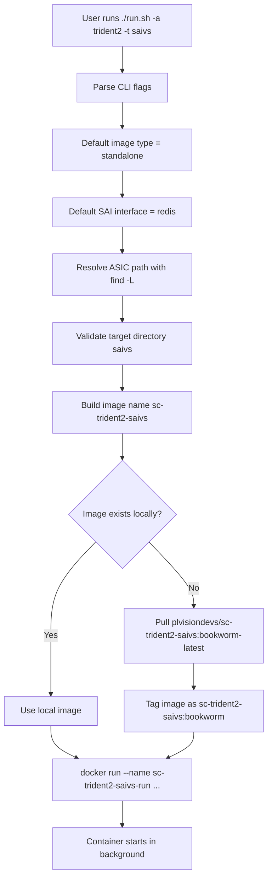
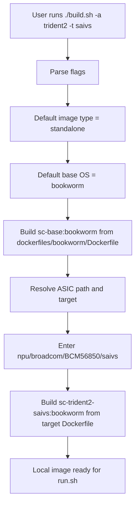
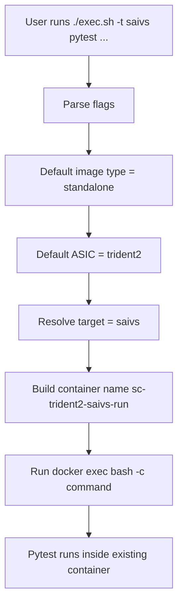
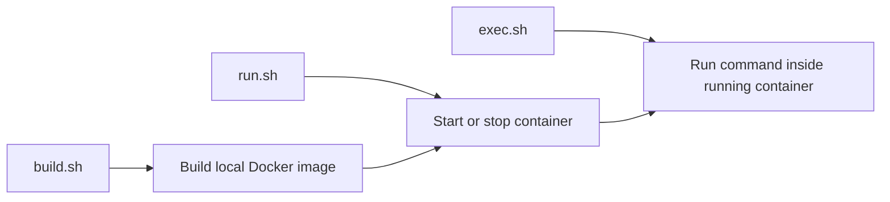
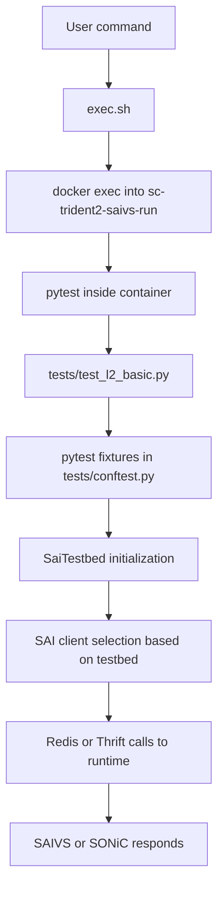
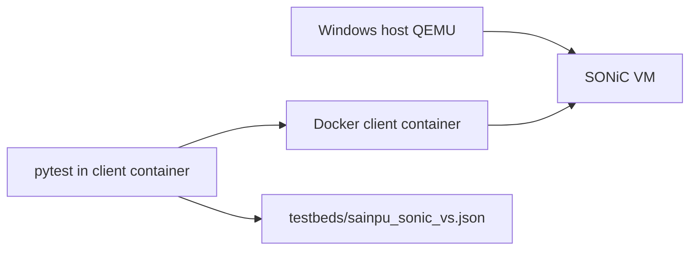

# SAI-Challenger Script Flow Deep Dive

## Purpose
This file explains what the launcher scripts do behind the scenes.
It is the next-level companion to the command guide.

Use this when you want to understand:
- what `run.sh` actually does
- what `-a trident2` means
- what `-t saivs` means
- how `exec.sh` finds the correct container
- which Dockerfiles and folders are used next
- how the code path flows from command line to test execution

---

## The 3 Main Scripts

### 1. `run.sh`
Purpose:
- Start or stop a Docker container for a chosen image type.
- If the image does not exist locally, pull it from Docker Hub.

Typical use:
```bash
./run.sh -a trident2 -t saivs
```

What it does at a high level:
1. Parses flags.
2. Resolves ASIC path and target path.
3. Decides container/image name.
4. Pulls image if missing.
5. Runs Docker container in detached mode.

Important point:
- `run.sh` does **not** call `build.sh`.
- It only starts a container from an already available local image or from a pulled published image.

---

### 2. `build.sh`
Purpose:
- Build Docker images locally from repo Dockerfiles.

Typical use:
```bash
./build.sh -a trident2 -t saivs
```

What it does at a high level:
1. Builds a base image from [dockerfiles/bookworm/Dockerfile](dockerfiles/bookworm/Dockerfile).
2. Builds a target image from [npu/broadcom/BCM56850/saivs/Dockerfile](npu/broadcom/BCM56850/saivs/Dockerfile).
3. Tags the resulting image so `run.sh` can use it.

Important point:
- `build.sh` is for local image creation.
- `run.sh` is for container start/stop.
- `exec.sh` is for running commands inside an already-running container.

---

### 3. `exec.sh`
Purpose:
- Run a command inside the correct running container.

Typical use:
```bash
./exec.sh -t saivs pytest test_vrf.py -v --testbed=saivs_standalone
```

What it does at a high level:
1. Parses flags.
2. Computes container name.
3. Uses `docker exec` to run your command inside that container.

Important point:
- `exec.sh` does **not** start containers.
- The container must already exist and be running.

---

## Your Common Command, Fully Explained

Command:
```bash
./run.sh -a trident2 -t saivs
```

Meaning of each part:

### `./run.sh`
Run the launcher script that starts a container.

### `-a trident2`
`-a` means ASIC family/name.

Inside [run.sh](run.sh), this becomes:
- `ASIC_TYPE="trident2"`
- Then the script searches the repo for a directory named `trident2` using `find -L`.

Why `find -L` matters:
- `-L` follows symlinks/reparse points.
- That allows `trident2` to resolve to the actual Broadcom platform layout behind it.

In practice for this repo, `trident2` maps into the Broadcom SAIVS implementation path used to build/run:
- [npu/broadcom/BCM56850/saivs/Dockerfile](npu/broadcom/BCM56850/saivs/Dockerfile)

Simple meaning:
- `trident2` selects the virtual ASIC model family you want to emulate/test.

### `-t saivs`
`-t` means target.

Inside [run.sh](run.sh), the target is looked up as a subdirectory under the ASIC path.
For this use case, `saivs` means:
- use the virtual switch target
- use the SAI virtual switch runtime, not a real hardware target

Simple meaning:
- `saivs` chooses the virtual switch implementation.

### No `-i` given
The script default is:
```bash
IMAGE_TYPE="standalone"
```
So your command is effectively:
```bash
./run.sh -i standalone -a trident2 -t saivs
```

Meaning:
- create/start one standalone runtime container
- the container itself contains the SAI runtime and test environment

### No `-s` given
The script default is:
```bash
SAI_INTERFACE="redis"
```
So your command is effectively:
```bash
./run.sh -i standalone -a trident2 -t saivs -s redis
```

Meaning:
- use Redis-based SAI interface by default

That is why the container name becomes:
```text
sc-trident2-saivs-run
```

If you had used thrift instead:
```bash
./run.sh -a trident2 -t saivs -s thrift
```
then the name would become:
```text
sc-thrift-trident2-saivs-run
```

---

## How `run.sh` Builds the Container Name

Inside [run.sh](run.sh):

- If `-s redis`, prefix is `sc`
- If `-s thrift`, prefix is `sc-thrift`
- For standalone mode, image name is:
```text
<prefix>-<asic>-<target>
```
- Runtime container name is:
```text
<image-name>-run
```

Example:
```text
prefix      = sc
asic        = trident2
target      = saivs
image name  = sc-trident2-saivs
container   = sc-trident2-saivs-run
```

---

## What `run.sh` Does Internally

### Code Path


### Actual Docker action
For standalone mode, [run.sh](run.sh) ultimately does something like:
```bash
docker run --name sc-trident2-saivs-run \
  --cap-add=NET_ADMIN \
  --device /dev/net/tun:/dev/net/tun \
  -v $(pwd):/sai-challenger \
  -d sc-trident2-saivs:bookworm
```

What that means:
- `--cap-add=NET_ADMIN`: allow network config inside container
- `--device /dev/net/tun`: allow virtual network/tunnel features
- `-v $(pwd):/sai-challenger`: mount your repo into the container
- `-d`: run detached in background

---

## What `build.sh` Does Internally

### Build Flow


### Why there are two Dockerfiles

#### Base Dockerfile
Used first:
- [dockerfiles/bookworm/Dockerfile](dockerfiles/bookworm/Dockerfile)

This installs:
- Debian bookworm base packages
- Redis
- PTF dependencies
- SAI-Challenger common code
- supervisor
- Python test dependencies

#### Target Dockerfile
Used second:
- [npu/broadcom/BCM56850/saivs/Dockerfile](npu/broadcom/BCM56850/saivs/Dockerfile)

This adds target-specific pieces:
- SAI Redis / SAIVS build
- syncd-vs
- target configs
- supervisor config for this ASIC/target

So the model is:
```text
base image + target-specific layer = final runnable image
```

---

## What `exec.sh` Does Internally

### Code Path


### Example
Command:
```bash
./exec.sh -t saivs pytest test_vrf.py -v --testbed=saivs_standalone
```

Internally becomes roughly:
```bash
docker exec -ti sc-trident2-saivs-run bash -c "pytest test_vrf.py -v --testbed=saivs_standalone"
```

So `exec.sh` is mainly a container-name resolver plus `docker exec` wrapper.

---

## Script Relationship

These scripts are parallel entry points, not parent/child scripts.



Important:
- `build.sh` does not call `run.sh`
- `run.sh` does not call `exec.sh`
- `exec.sh` does not call `run.sh`
- You call them in sequence as the operator

Typical user sequence:
```text
build.sh (optional) -> run.sh -> exec.sh
```

Or if using published images:
```text
run.sh -> exec.sh
```

---

## How the Test Command Reaches the Code

Example:
```bash
./exec.sh -t saivs pytest test_l2_basic.py -v --testbed=saivs_standalone
```

Execution chain:


Simple meaning:
- your shell command does not directly call Python test code on the host
- it enters the container first
- then pytest loads the tests and fixtures inside the container

---

## What the Key Flags Mean

### `-a`
ASIC family name.
Example:
```bash
-a trident2
```
Meaning:
- choose the platform family directory
- used to locate target Dockerfiles and configs

### `-t`
Target under that ASIC.
Example:
```bash
-t saivs
```
Meaning:
- choose the implementation mode / target folder
- here it means virtual switch target

### `-i`
Image type.
Possible values in these scripts:
- `standalone`
- `client`
- `server`

Meaning:
- `standalone`: all-in-one runtime container
- `client`: client-only image/container
- `server`: server/runtime side split deployment

### `-s`
SAI interface.
Possible values:
- `redis`
- `thrift`

Meaning:
- `redis`: Redis-based SAI backend
- `thrift`: Thrift-based SAI backend

### `-o`
Base OS for image build/run naming.
Examples:
- `bookworm`
- `bullseye`
- `trixie`

Meaning:
- choose Debian generation used for the image tag and Dockerfile path

---

## Why Ubuntu WSL Works Well for Experiment 1 and 2

For SAIVS standalone:
- one container contains runtime + tests
- veth and Linux networking features are available
- dataplane tests can run in software

That is why this worked well in your session.

---

## Why Experiment 3 Uses a Different Shape

Experiment 3 is not using `run.sh` for the SONiC VM itself.
Instead:
- SONiC VM is started by QEMU from the host side
- `sc-client-run` is a separate client container
- `sonic-ssh-fwd` forwards SSH to the VM
- tests use the `sainpu_sonic_vs` testbed to talk Redis to SONiC

So the shape is:


This is different from Experiment 1 and 2, where everything is inside one SAIVS container.

---

## Fast Mental Model

If you want the shortest understanding, remember this:

### For SAIVS
```text
run.sh = start virtual switch container
exec.sh = run tests inside it
```

### For local build
```text
build.sh = create image from Dockerfiles
run.sh   = start container from image
exec.sh  = enter container and run pytest
```

### For SONiC QEMU
```text
QEMU starts VM
Docker client container runs pytest
testbed file tells code how to connect to SONiC
```

---

## Files Most Relevant To Read Next

For launcher understanding:
- [run.sh](run.sh)
- [build.sh](build.sh)
- [exec.sh](exec.sh)

For image construction:
- [dockerfiles/bookworm/Dockerfile](dockerfiles/bookworm/Dockerfile)
- [dockerfiles/bookworm/Dockerfile.client](dockerfiles/bookworm/Dockerfile.client)
- [npu/broadcom/BCM56850/saivs/Dockerfile](npu/broadcom/BCM56850/saivs/Dockerfile)

For runtime/test loading:
- [tests/conftest.py](tests/conftest.py)
- [testbeds/sainpu_sonic_vs.json](testbeds/sainpu_sonic_vs.json)

---

## Final Answer To Your Main Question

When you run:
```bash
./run.sh -a trident2 -t saivs
```

it means:
- start a standalone container
- for ASIC family `trident2`
- using virtual switch target `saivs`
- using Redis by default
- with image/container naming derived automatically
- mounting your repo into the container so tests can be executed from there

It is basically a smart Docker wrapper around the repo's platform layout.
